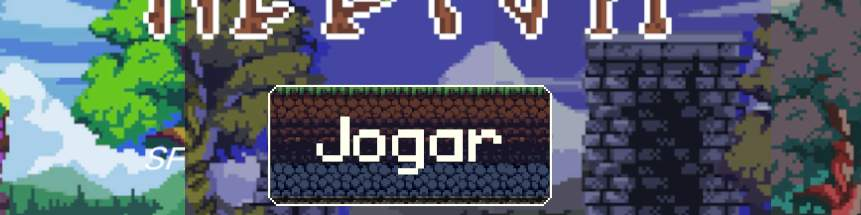

# Helium (Alpha)

<!-- Thumb -->
 

### Sobre

Trata-se de um *point-and-click* de múltiplas fases em que seu objetivo é direcionar o sol até as maçãs. Sabendo que as frutas absorvem esse espectro de luz, deve-se do fenômeno da difração -- a capacidade da luz de contornar obstáculos (e superar dificuldades (; ) para garantir que cada maçã seja atingida por pelo menos um feixe. O jogo acaba quando você chega em um nível impossível. :FeelsBadMan:

<!-- Screenshot da gameplay

    

-->

### Menu inicial

<!-- Screenshot do menu -->

    

O menu acessível consiste em:
- Jogar;
- Opções;
    - Filtros de daltonismo;
     <!-- Colagem lado-a-lado do menu com diferentes filtros de daltonismo -->
    - Volume:
        - Mixagem dos efeitos sonoros e da música ambiente;
    - Alternância estéreo/mono;
- Créditos; e
- Sair.

<!-- Screenshot do menu de opções -->

    

Além dessas especificações, o design do menu é feito em alto contraste, além de valer-se da dificuldade adaptativa dos níveis que seguem do tutorial. Nenhuma informação é transmitida apenas por texto ou som.

## Feito por
- [Arif Drumond](https://github.com/drumon-iq);
- [John Wesley](https://github.com/JohnBaska);
- [Ketelin Luana](https://github.com/Ketelinluana);
- [Matheus Telles](https://github.com/matheus-telles); e
- [Pedro Henrique](https://github.com/devwannabe-dot).
