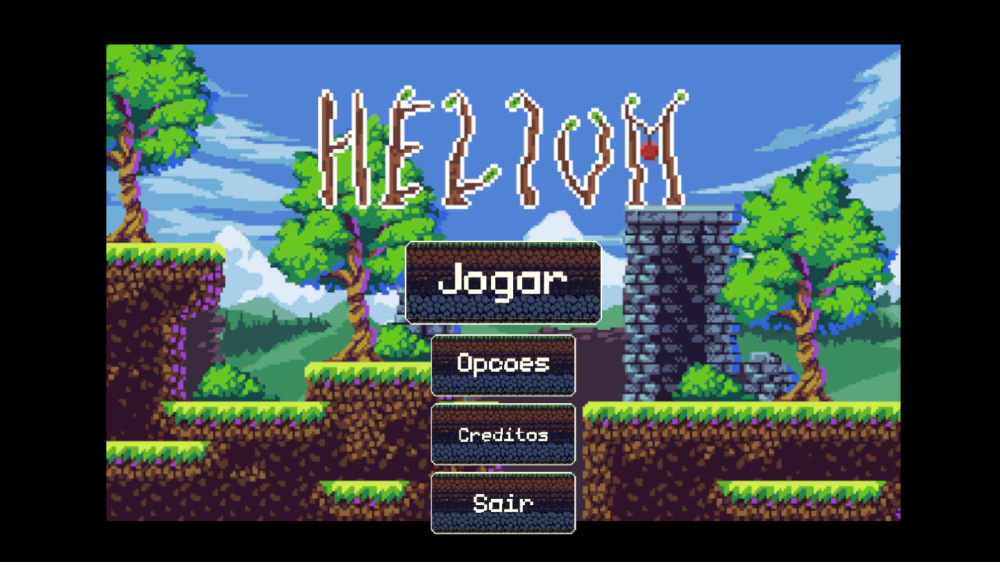

# Parkour (nome provisório)

<!-- Thumb -->
 

## Sobre

<!-- Screenshot da gameplay

    

-->

### Menu inicial

<!-- Screenshot do menu -->

    

O menu, voltado para a acessibilidade, consiste em:
- Jogar;
- Opções;
- Créditos;
- Sair.

### Opções para a acessibilidade
Dificuldade dinâmica/adaptativa é parte essencial do jogo, portanto não será opcional.
- Volume;
    - SFX;
    - Música;
- Filtros de cor;
- Alto-contraste;

## Feito por
- [Arif Drumond](https://github.com/drumon-iq);
- [John Wesley](https://github.com/JohnBaska);
- [Ketelin Luana](https://github.com/Ketelinluana);
- [Matheus Telles](https://github.com/matheus-telles); e
- [Pedro Henrique](https://github.com/devwannabe-dot).
